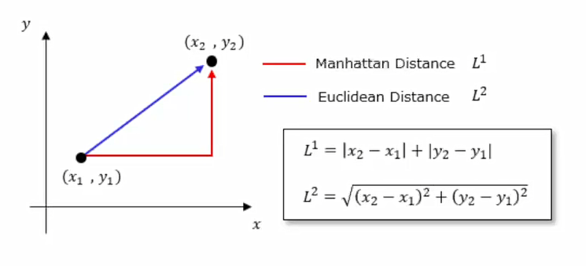
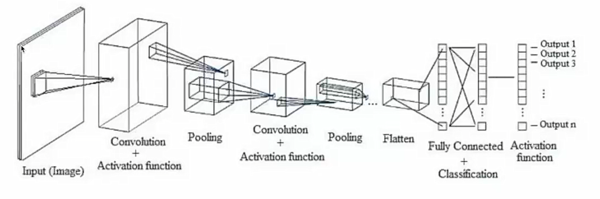
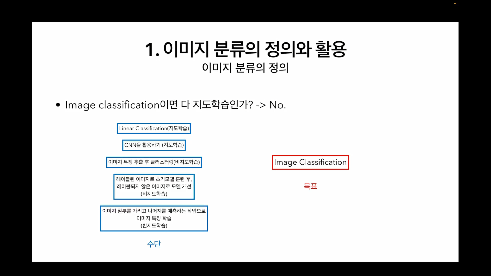
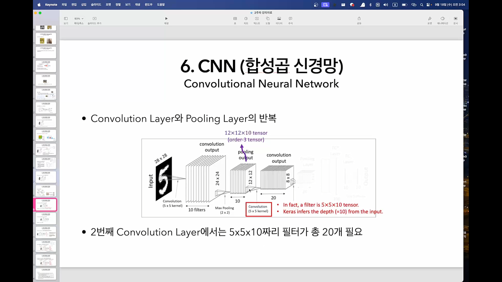

___
# gdsc study basic AI

week3

정준석

___

# Weekly I Learned (wil)

## week3 wil

### 기본적인 이미지 분류 접근 방식

- Raw-pixel

    픽셀 값을 직접 비교하여 판단 (무식한 방법)

    1. 모든 이미지를 같은 크기로 조정 ex) 32*32

    2. 각 이미지를 1차원 벡터로 펼침 ex) 32*32=1024차원

    3. 새 이미지와 기존 이미지의 벡터 간 거리 계산

    4. 가장 거리가 가까운 이미지의 클래스로 새 이미지 분류

- 벡터 간 거리 계산 방법

    - Manhattan Distance ; L1 = |x2-x1| + |y2-y1|

    - Euclidean Distance ; L2 = root( (x2-x1)^2 + (y2-y2)^2 )

    

### 이미지 분류의 Challenge한 점

- Boxed ; 이미지의 일부가 가려져 있는 경우

- Shifted ; 이미지가 평행이동 되어 있는 경우 / 상하좌우로 늘려져 있는 경우

- Tinted ; 색조가 입혀져 있는 경우

- 시점 차이 ; 앞에서 바라보았는지, 옆에서 바라보았는지

- 조명 변화 ; 밝고 어두움

- 한 카테고리 내의 동물이더라도 다른 포즈 ; 뛰어 다니는지, 가만히 있는지

다양한 변수가 너무 많음 -> Robust Classifier를 만들어야 함 -> CNN

### CNN

- FNN ; Fully-connected multi layered Neural Network

    공간 정보를 싹 무시하고 이미지를 한 줄로 쫘라락하여 이미지에 대한 정보 손실 발생

1. Convolution Layer
    
    A Convolution Layer = Convolution + Activation

    input image에 filter를 적용하여 feature map을 얻는다
    
    > 예를 들어, `28*28` image에 10개의 `5*5` kernel filter를 각각 적용하여 `24*24` feature map(convolution output)을 10개 얻는다.

    Non-Linear Activation function을 사용해야 한다.

        선형 변환을 여러번 적용하여도 하나의 선형 변환으로 축소된다.

        f( W1*x + b1 ) =  W2(W1*x + b1) + b2 = Wx + b

        ex) Sigmoid, Hyperbolic Tangent, ReLU, etc...

2. Pooling Layer

    feature map(convolution output)의 크기를 줄이는 역할

    > 예를 들어, 10개의 `24*24` feature map(convolution output)에 각각 `2*2` pooling을 적용하면 10개의 `12*12` feature map(pooling output)이 만들어진다.

    - Max Pooling

    - Average Pooling

3. Convolution Layer, Pooling Layer 반복

4. Fully Connected Layer

### 궁금한 점

> "레이블된 이미지로 초기모델 훈련 후,
레이블되지 않은 이미지로 모델 개선
(비지도학습)"

준지도학습 아닌가요?? labeled data와 unlabeled data를 함께 쓰니까 준지도학습인 거 같아서 헷갈리네요

두번째 Convolution Layer에서 `5*5*10`짜리 filter가 총 20개 필요한 이유를 잘 모르겠어요. 20채널로 할지 30채널로 할지는 우리가 정하기 나름인 건가요?

___

## week1 wil

### Quiz

1. 정답1 : 3

    외부 레이블 없이 데이터 자체에서 감독 신호를 생성하는 학습방법은 준지도학습입니다.

2. 정답2 : 
    단일 퍼셉트론은 두 개의 클래스를 하나의 직선으로(선형적으로) 분류합니다. 출력이 0인 클래스 (0,0), (1,1)과 출력이 1인 클래스 (0,1),(1,0)을 하나의 직선으로 분류할 수 없기 때문입니다.

3. 정답3 : ans1 = (0) , ans2 = (1)

### Component of DL

    - data

    - model

    - loss function

### 모델이 데이터를 학습하는 방법

- Supervised Learning ; 지도학습

    data와 label을 함께 제공하여 학습.

    ex) binary classification, 주식 가격 예측

- Unsupervised Learning ; 비지도학습

    label이 없는 data를 통해 학습. 데이터들의 구조를 학습하는 데 집중. 데이터 간 유사성을 찾는 작업에 사용됨.

    ex) Clustering, PCA, 우유를 산 고객이 빵도 살 확률, 추천시스템

- Semi-supervised Learning ; 준지도학습

    소량의 고품질 labeled-data와 대량의 unlabeled-data를 결합하여 학습.

    ex) 아이폰의 인물 분류 기능

- Self-supervised Learning ; 자가지도학습

    unlabeled-data에서 자동으로 지도 신호를 생성하여 학습.

### Perceptron ; 퍼셉트론

binary classifier(이진 분류기). supervised learning 방식으로 학습.

output = ∑(weight * input) + bias

y = ∑(wx) + b

- w ; weight
    
    가중치. input의 중요도 반영. 신경망이 학습되면서 조정되는 값

- b ; bias
    
    편향. 출력을 조정함

- 활성화 함수

### 잡다한 용어정리

- Image Classification ; 이미지 분류

    주어진 이미지가 어떤 카테고리에 속하는지 분류하는 작업

- Semantic segmentation

    - semantic : 의미의, 의미론적인

    - segmentation : 분할

    이미지 내의 각 픽셀을 특정 클래스로 분류.

    ex) 하나의 사진 안에서 하늘, 나무, 고양이, 잡초 등을 구분하는 거

- Clustering ; 군집화

    One of unsupervised learning. unlabeled-data 중 비슷한 데이터끼리 묶는 작업.
    
    데이터 간의 패턴 발견할 때 사용.

    K-Means ; one of clustering algorithm
        
        데이터를 K개의 그룹으로 나누고, 각 클러스터는 centroid(중심점)을 갖는다. 데이터 포인트들은 자신과 가장 가까운 중심점에 할당. centroid와 데이터 포인트 간의 distance를 최소화하는 방식으로 clustering이 이루어짐.

- PCA ; 주성분 분석

    Principal Component Analysis. One of 차원 축소 기법.

    데이터의 중요한 패턴은 유지하면서도 복잡성을 줄이는 방법.

- CNN ; Convolutional Neural Network

    convolutional : 나선형의

    합성곱 신경망.

- KNN ; K-Nearest Neighbors

- 순전파
- 역전파
    
    잘 모르겠다. 다음에 더...

- Tensor ; 텐서

    다차원 배열.

    0차원 텐서 ; 스칼라

    1차원 텐서 ; 벡터

    2차원 텐서 ; 행렬

    3차원 텐서 ; 다차원 배열

### 추가로 찾아본 것들

- 인공지능 하위 분야

    ML, DL, Computer Vision, NLP(자연어처리), etc...

- 인공지능 분야에서 쓰이는 수학들

    선형대수학, 확률및통계, 미적분학, 이산수학, etc...

___